# Game Design Document

    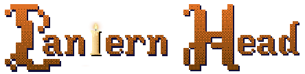

## Table of contents

- [Game Overview](#game-overview)
- [Characters](#characters)
- [Gameplay and Mechanics](#gameplay-and-mechanics)
- [World Design](#world-design)
- [Art and Audio](#art-and-audio)
- [User Interface](#user-interface)
- [Technology and Tools](#technology-and-tools)
- [Team Communication, Timeline, and Task Assignment](#team-communication-timeline-and-task-assignment)
- [Possible Challenges](#possible-challenges)

## Game Overview

<table style="border: none;">
    <tr style="border: none;">
        <td style="border: none;">
            Lantern Head™️ is an isometric, rogue-lite(-like) action/horror game in which light and shadow are a core gameplay element. Fight enemies, explore the world, and keep the flame alive 🔥
        </td>
        <td style="border: none;">
            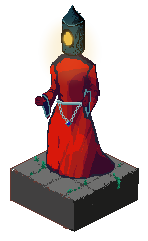
            
Created with Aseprite

        </td>
    </tr>
</table>

### Core Concept

<table style="border: none;">
    <tr style="border: none;">
        <td style="border: none;">
            Tasked with protecting a sacred light from the encroaching darkness, they must navigate the night and evade the minions of the dark. Chased by the "darkness" and its zealous supporters, the acolyte's mission is to ensure the flame remains lit, representing hope for another day. With just 5 minutes until dawn, every second counts, for if the flame is extinguished, fear will spread unchecked throughout the land.
        </td>
        <td style="border: none;">
            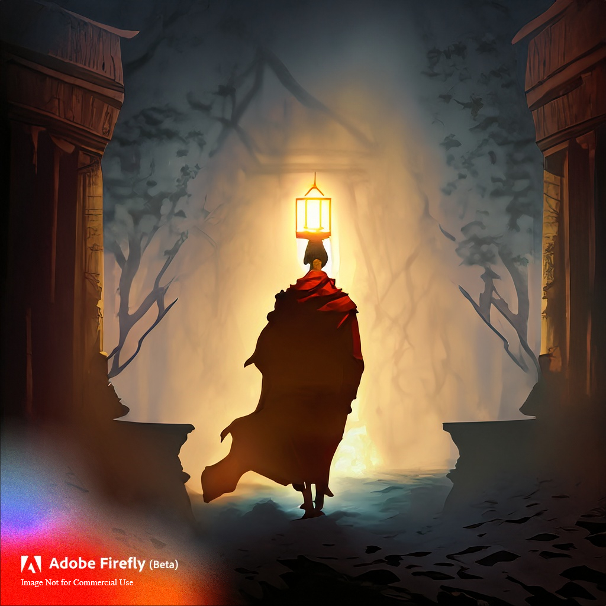
        </td>
    </tr>
</table>

### Genre

<b>Horror Survival</b>

<table>
    <tr>
        <td>
            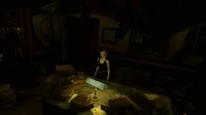
        </td>
        <td >
            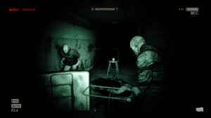
        </td>
            <td>
                 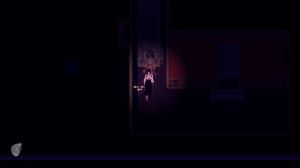
        </td>
    </tr>
</table>

Eternal Darkness (l.), Outlast (m.), Unknown (r.)

 

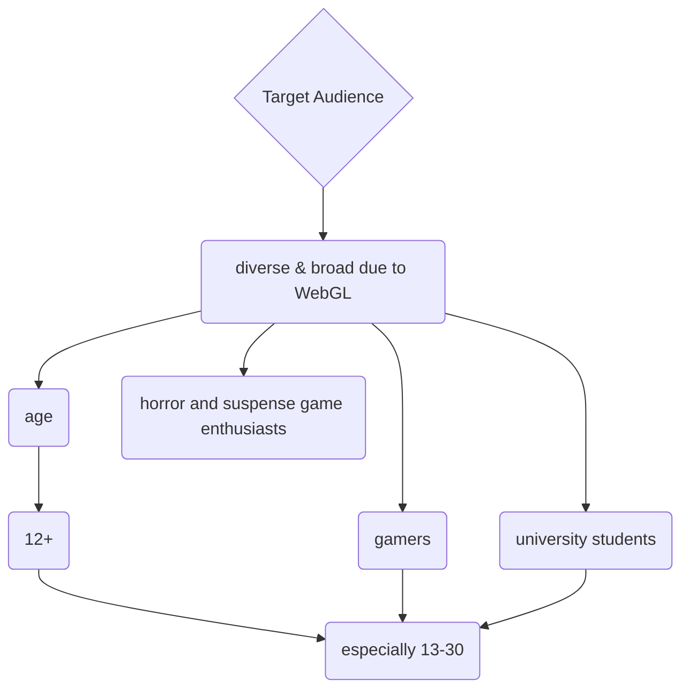
```mermaid
    graph TD;
    A{Target Audience}-->B(diverse & broad due to WebGL);
    B-->C(age);
    C-->D(12+);
    D-->E(especially 13-30);
    B-->F(gamers);
    B-->G(horror and suspense game enthusiasts);
    B-->H(university students);
    F-->E
    H-->E
```

### Unique Selling Points

<table style="border: none;">
    <tr style="border: none;">
        <td style="border: none;">
            <b>Light</b>üí° 
            Acting as both a pivotal navigational guide and a direct indicator of health. Also, its glow is the only means to reveal concealed enemies.
        </td>
        <td style="border: none;">
            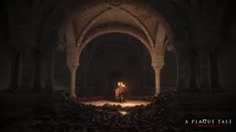
            
Inspiration: A Plague Tale

        </td>
    </tr>
</table>
Other Game Differentiators  

- Pixel art style
- Strategy (resource utilization, how to deal with the enemy)

## Characters

1.  Main Character

    - The last keeper of the flame, tending to their god’s decaying temple as they struggle to keep the darkness out. As a reward for their devotion, they have been transformed into a living lantern.

        

            
             Image created using Aseprite
        

    - Inspiration:

    <table>
        <tr>
            <td>
                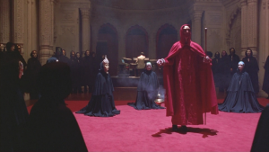
            </td>
            <td >
                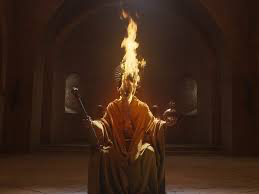
            </td>
            <td>
                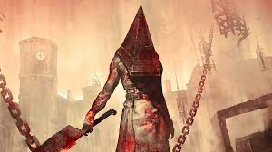
            </td>
        </tr>
    </table>
    
Eyes Wide Shut (l.), The Green Knight (m.), SilentHill (r.)

     

2.  Shadow Enemy

    - Shadow/ghost-looking creatures. More details described in [Enemies and Combat](#enemies-and-combat)

    - Inspiration:

    <table>
        <tr>
            <td>
                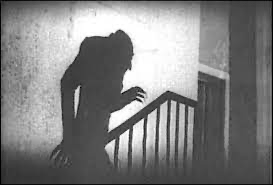
            </td>
            <td >
                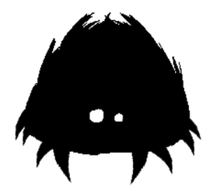
            </td>
            <td>
                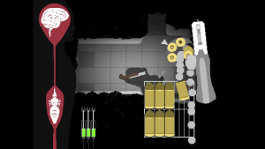
            </td>
        </tr>
    </table>
    
Nosferatu (1922) (l.), Crawling Horror from Don't Starve (m.), Endoparasitic (r.)

     

    - Actual enemy look
    <table>
        <tr>
            <td>
                
            </td>
            <td >
                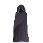
            </td>
            <td>
                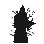
            </td>
        </tr>
    </table>

## Gameplay and Mechanics

### Core Gameplay Loop

<table style="border: none;">
    <tr style="border: none;">
        <td style="border: none;">
            <ul>
                <li>Explore the world, finding:
                <ul>
                    <li>health potions and lantern fuel</li>
                    <li>torch and candles, lit to keep the central fire lit</li>
                </ul>
                </li>
                <li>Fight and kill enemies</li>
                <li>Don't die</li>
                <ul>
                    <li>If the player dies, they can retry the game, which will reset the timer back to 5 minutes.</li>
                </ul>
            </ul>
        </td>
        <td style="border: none;">
            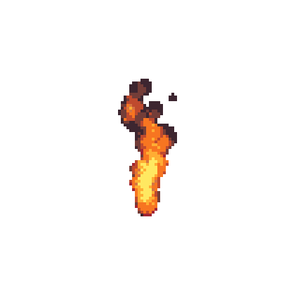
            <a href="https://codemanu.itch.io/pixelart-effect-pack">Source</a>
        </td>
    </tr>
</table>

### Player Movement

- 8-directional movement system (N, NE, E, SE, S, SW, W, NW)
- Walking backwards incurs speed penalty

### Enemies and Combat

- Enemies are ghost-like creatures with a melee attack or ranged attack

    
     Source: Nosferatu (1922)

<b>Health & Stats</b>

<table>
    <thead>
        <tr>
            <th>Attack type (player)</th>
            <th>Description</th>
            <th>Damage Shadow Enemy</th>
        </tr>
    </thead>
    <tbody>
        <tr>
            <td>Melee attack</td>
            <td>Close-combat attack performed with hands</td>
            <td>35%</td>
        </tr>
        <tr>
            <td>Lantern attack</td>
            <td>Beam of light emanating from the player character damages any enemies in its path</td>
            <td>45%</td>
        </tr>
    </tbody>
</table>

- Around 6 enemy attacks will reduce the player to 0 health

### Enemy Spawning and Behaviour

- Enemies attempt to spawn in a random position in a radius of 5 around the player.
- Enemies will attempt to find valid spawn positions up to 10 times before a spawn fails.
- If the spawn was successful the spawner will wait 7.5 seconds before attempting to spawn another, otherwise it will wait a quarter of that time.
- Each successful attempt has a 25% chance of spawning a ranged enemy and a 75% chance of spawning a melee enemy.
- Enemies will despawn if their distance from the player passes 7.
- Spawning will continue for as long as the number of living enemies is less than 5 + the number of minutes since game start.
- Enemies will wander around until they have line of sight of the player, and will move to the players last known position when line of sight is lost
- Ranged enemies will wait and fire from their vision range while the player is still visible
- All enemies have a 50% chance of dropping either a health potion or fuel, with equal probability

### Lantern/Light feature

<table>
    <thead>
        <tr>
            <th>Fuel level</th>
            <th>Description</th>
        </tr>
    </thead>
    <tbody>
        <tr>
            <td>0-10%</td>
            <td>30% decreased movement speed   No use of special attack possible</td>
        </tr>
        <tr>
            <td>11-30%</td>
            <td>15% decreased movement speed  No use of lantern attack possible</td>
        </tr>
        <tr>
            <td>31-50%</td>
            <td>5% decreased movement speed  Lantern attack possible - 1/5th of fuel reserves per attack (half of the damage points apply)</td>
        </tr>
        <tr>
            <td>51-70%</td>
            <td>ormal movement speed  Lantern attack possible - 1/5th of fuel reserves per attack</td>
        </tr>
        <tr>
            <td>71-90%</td>
            <td>5% increased movement speed  Lantern attack possible - 1/5th of fuel reserves per attack</td>
        </tr>
        <tr>
            <td>91-100% </td>
            <td>10% increased movement speed  Lantern attack possible - 1/5th of fuel reserves per attack (double of the damage points apply)</td>
        </tr>
    </tbody>
</table>

Inspiration for games where light is important for gameplay include Cryospace and Amnesia: The Dark Descent.

   <a href="https://www.dsogaming.com/news/cryospace-is-a-new-isometric-horror-game-heavily-inspired-by-alien-and-philip-k-dick-novels/">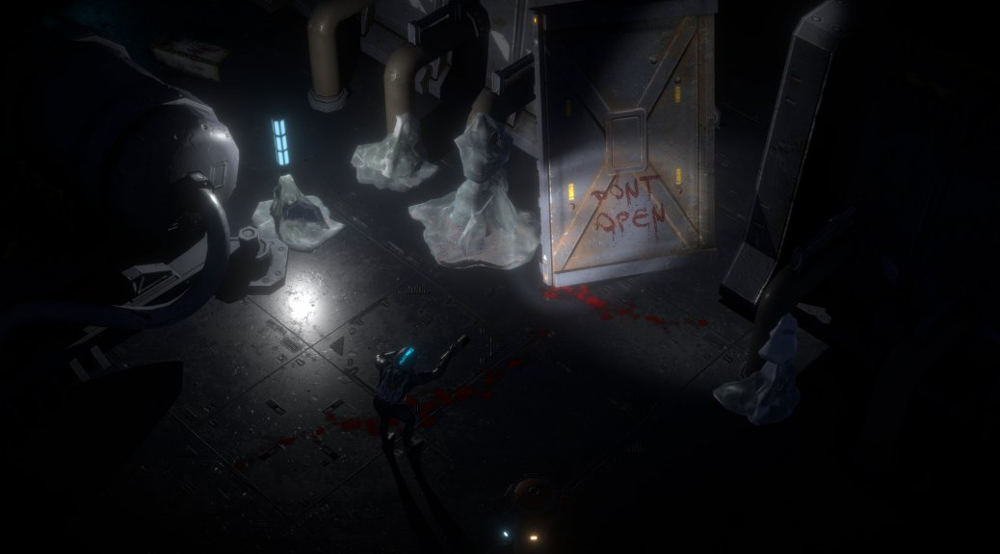</a> 
  Gameplay still from Cryospace showing limited visibility and a player controlled light source

### Central Fire

    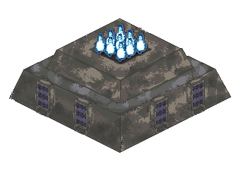

- Fire need to stay lit, for that to happen the player needs to light torches and candles that are spread across the map
- If the fire goes out, the player dies
- Since there is no light source lit at the beginning, we have built in a delay of 30 seconds.
- Depending on how many light sources are lit, the size of the fire changes (calculation of the states in the table below)
- The light sources can also be blown out again by enemies or by a random snuff effect that we have implemented (Therefore, the player must constantly light the light sources and cannot light them only once at the beginning and then hide)

| State            | 0   | 1     | 2      | 3      | 4      | 5       |
| ---------------- | --- | ----- | ------ | ------ | ------ | ------- |
| Lightsources lit | 0%  | 1-20% | 21-40% | 41-60% | 61-80% | 81-100% |

### Camera/View

- Fixed rotation 3rd person isometric with approx. 45° viewing angle
- Player is locked to centre of screen (camera moves with player movement)
- When the player reaches the edge of the game world, they will be slightly off centre; this allows the player to see more of the game world while near its edge.
  - This is demonstrated in the diagram below. Note how in FOV 2 the player is off-centre.

    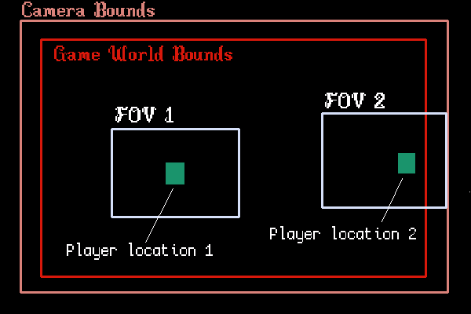

   
- We have decided to use a moving camera as it can make the gameplay feel more dynamic - well suited to the action/horror genre

Underrail (2015) is a good example of the intended viewing angle:

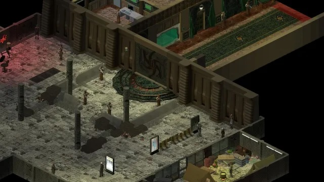

And Synthetik (2018) uses a camera locked to the players movements:

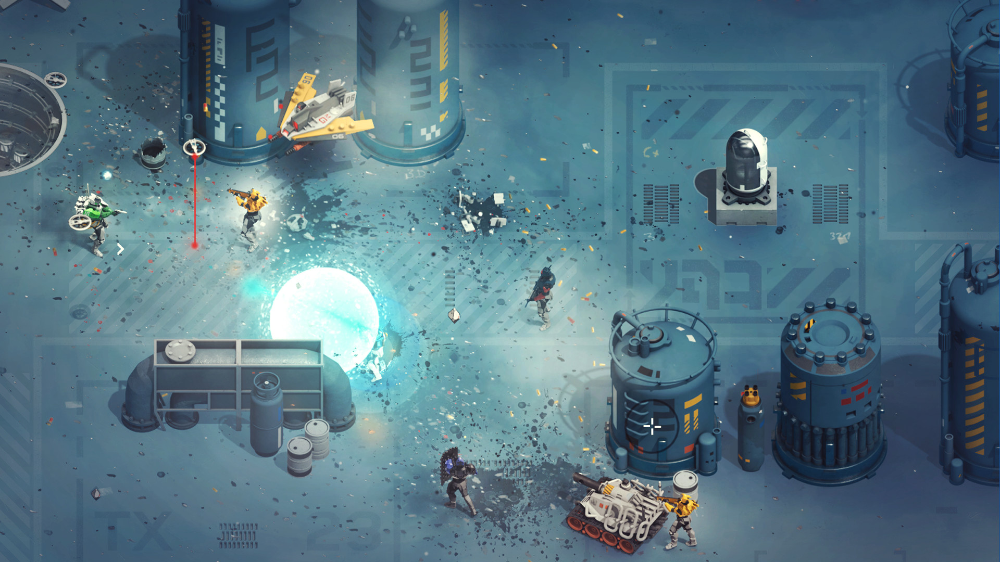

Actual in-game camera view

    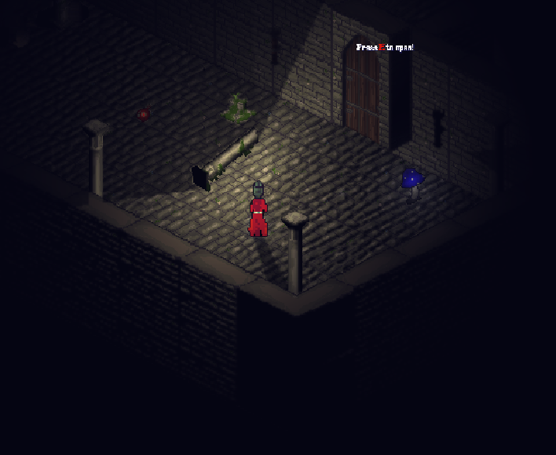

### Controls

    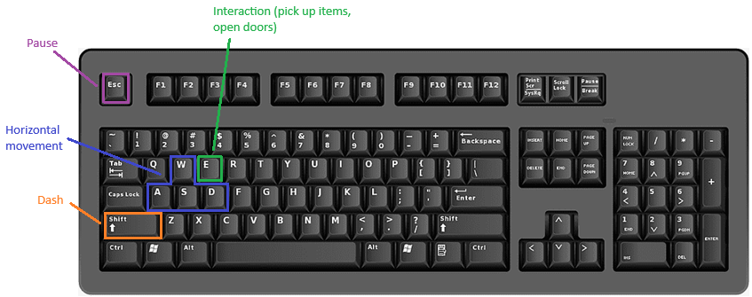
    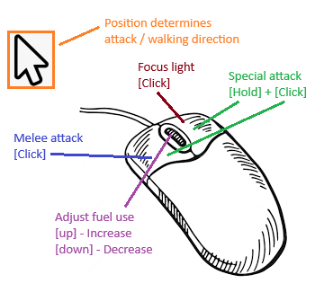

- Left Shift to _dash_, briefly increasing movement speed.
- Escape button to show pause menu while in game (Implemented so that the player can check the controls again during the game)

### Progression

As a roguelite-inspired game, Lantern Head features permadeath and items that do not persist between playthroughs.

Within a single playthrough, difficulty will increase due to
attrition of resources if the player overuses their potions/lantern oil

## World Design

Lantern Head takes place within the confines of an abandoned religious compound, in the style of an old-world monastery or cathedral.

This temple shows signs of advanced decay, as plant growth gradually reclaims the crumbling masonry, giving the player the sense that they are the last defender of this place against the unknown and wild forces outside its walls.

One inspiration for this is the abandoned 12th-century Monastery of Santa Maria de Seiça in Portugal:

    
    

And this abandoned church photographed by Roman Robroek:

    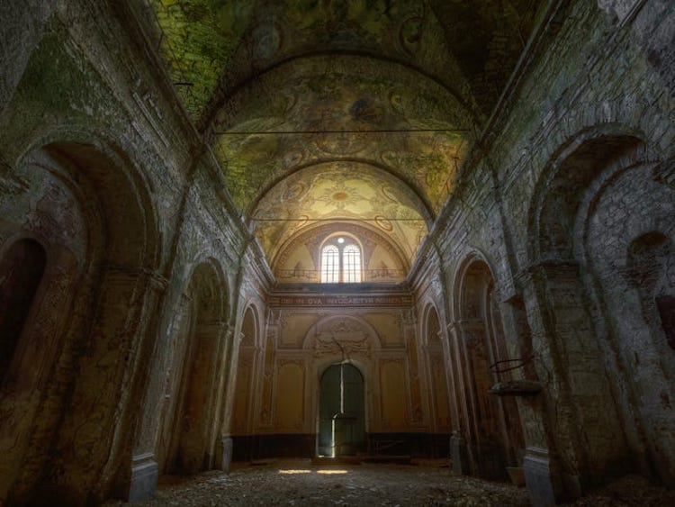

Other inspirations:

<table>
    <tr>
        <td >
            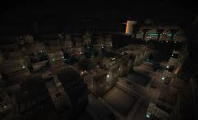
        </td>
        <td>
            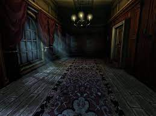
        </td>
        <td>
            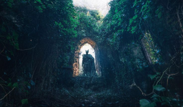
        </td>
    </tr>
</table>

Minecraft (l.), Amnesia - The Dark Descent (m.), The Green Knight (r.)

Actual in-game environment

<table>
    <tr>
        <td >
            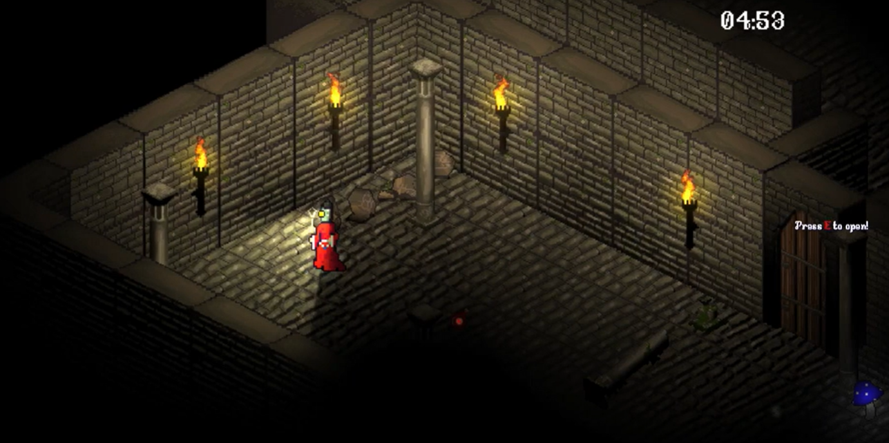
        </td>
        <td>
            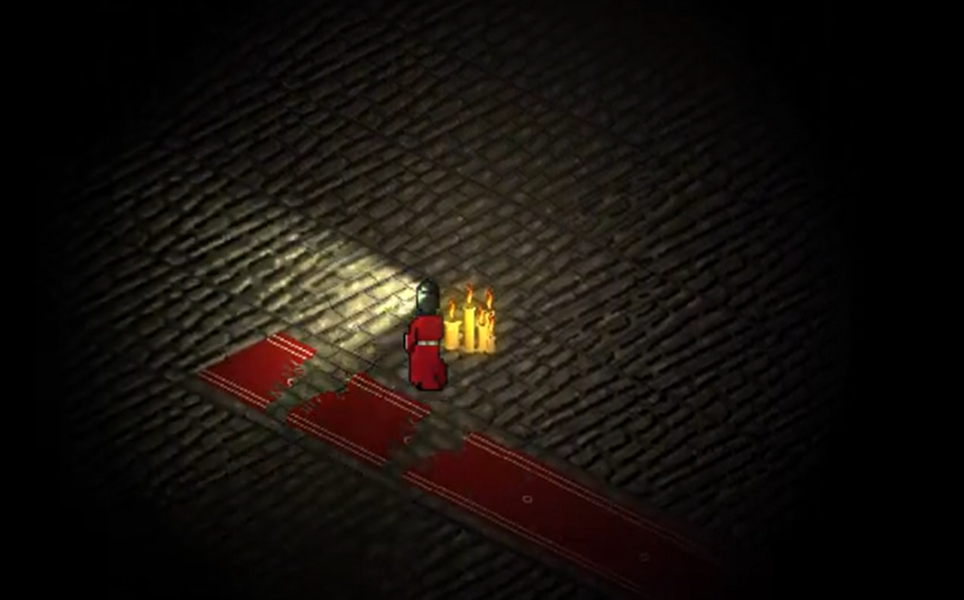
        </td>
    </tr>
</table>

### Layout

The game will take place entirely indoors. The level design will take inspiration from real-life religious buildings.

        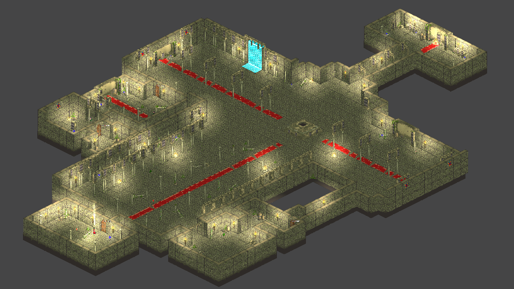
        
 The world will feature sections ranging from grand halls to claustrophobic corridors.

### Game World Graphics and Physics

The game world will be rendered in "2.5D" using a pixel art tileset. The tilemap will be overlayed with a static collider for simple player-object and enemy-object collisions.

No elements in the game world will require other physics simulation.

Light and shadow is an important gameplay element in Lantern Head. Lighting will be handled by Unity's 2D Universal Render Pipeline (URP), which enables 2D objects (such as sprites) to interact with light and cast shadows as if they were 3D objects.

Towards the very end of the game, the sun will begin to rise. It is intended that a gradient of light intensity and color will provide a visual to hint the player that they are close to finish the game. A global lighting gradient mockup, with respect to game time, can be seen below.

    
    
Demonstration of color change across the 5 minutes of game time. Created using Aseprite.
    

### Interactivity

- _Environmental lighting_: candles and torches. Able to be snuffed out by enemies and relit by the player

    <figure>
        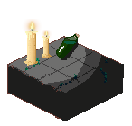
    </figure>

- _Oil containers_: found throughout map, essential for refilling player's lantern

    <figure>
        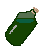
    </figure>

- _Health potions_ to heal player character

    <figure>
        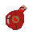
    </figure>

- _Doors_: manually opened to enter certain rooms

## Art and Audio

<b> Art Style: Pixel Art </b>

Our team loves the pixel art style and thinks that it will be the best fit for our game for the following reasons:

- <b>Unique Aesthetic Appeal</b>: Utilizing pixel art for a horror game adds a distinctive visual charm that stands out in a genre dominated by realistic graphics.
- <b>Engage player's imagination</b>: Pixel art invites players to engage their imaginations, filling in the gaps between pixels with their perceptions of fear. This active participation can intensify the player's overall horror experience.
- <b>Showcase the potential of pixel art style</b>: Pushing the boundaries of pixel art by demonstrating that pixel art can effectively evoke fear, suspense, and mystery.

<b>Color and Atmosphere</b>: The game is going to implement a high contrast between light and shadow with mainly dark blue or green color to build an overall suspenseful and dark atmosphere

<b> Concept Art and References for the Art Style </b>

    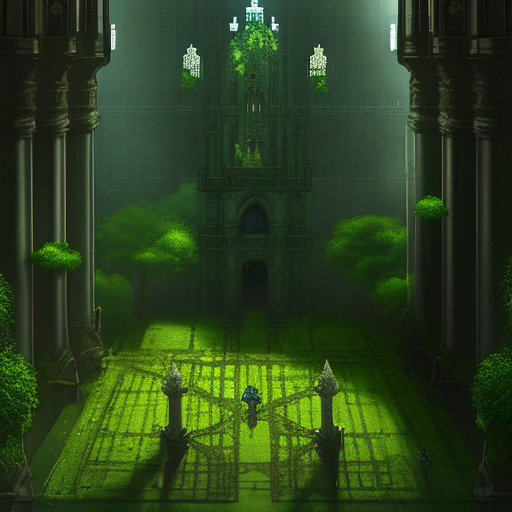
     Image generated by Automatic 1111

    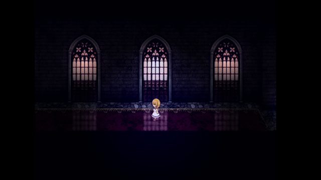
     Source: The Witch's House

    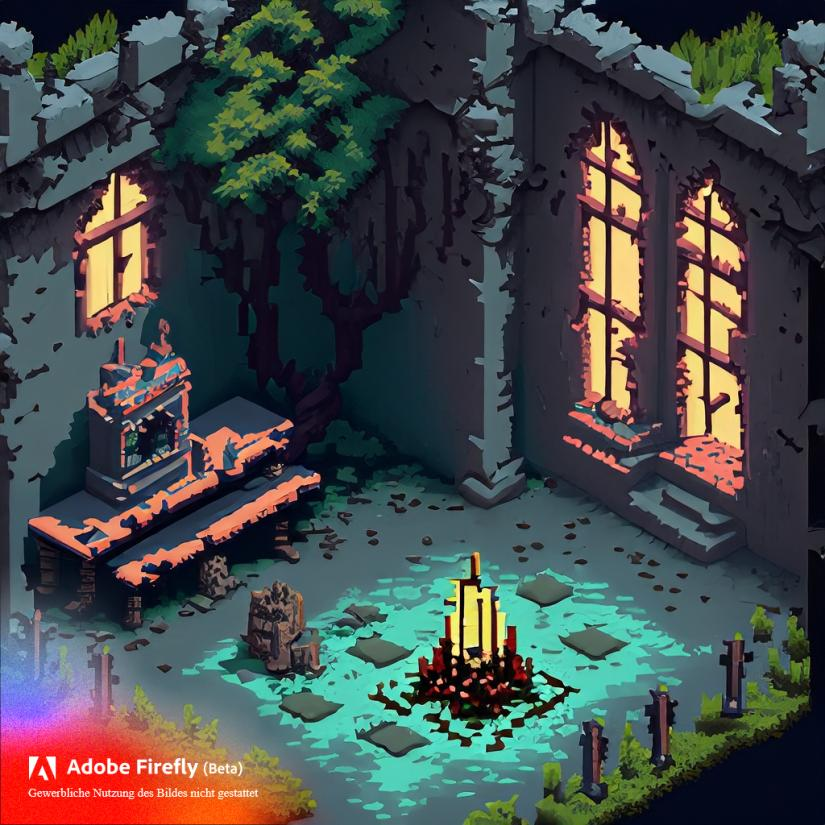
    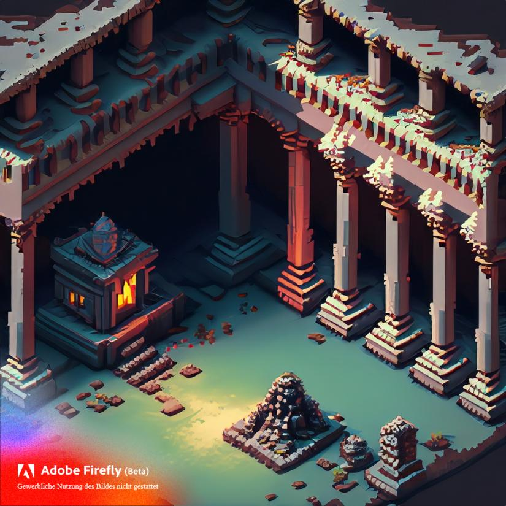
     Images generated by Adobe Firefly

 

<b>Game audio mainly source from:</b>

1. [Opengameart.org](https://opengameart.org/)
2. [Pixabay](https://pixabay.com/)
3. [Youtube](https://www.youtube.com/)

<b>Feelings / Styles that we want to convey through the soundtracks and sound effects</b>

- Minimalistic
- Suspenseful
- Dark
- Gothic

 

<b>List of Candidate Soundtracks</b>
| Soundtracks | Sources|
| -------- | -------- |
| Starting Screen | [György Ligeti - Atmospheres](https://youtu.be/RCNzwdLwA8g?t=289) |
| In-game Background | [Brandon75689 - Cave Theme](https://opengameart.org/content/cave-theme)|
| Game Over | [Clement Panchout - Game Over Jingles Pack - 48 GameOverJingle Saturday](https://opengameart.org/content/69-game-over-jingles-pack) |

 

<b>List of Candidate Sound Effects</b>
| Sound Effects | References |
| -------- | -------- |
| Speical Attack | [Fuel explosion](https://mixkit.co/free-sound-effects/fire/) |
| Melee Attack | [Opengameart.org - 3 melee sounds](https://opengameart.org/content/3-melee-sounds/) |
| Open Door | [Pixabay - Door open and close](https://pixabay.com/sound-effects/door-open-and-close-65541/) |
| Close Door | [Pixabay - Door open and close](https://pixabay.com/sound-effects/door-open-and-close-65541/) |
| Candle Snuff when Enemy Approaches | [Mixkit - Wizard fire woosh / Ghost fire woosh](https://mixkit.co/free-sound-effects/fire/) |
| Heal | [Opengameart.org - 3 heal spells](https://opengameart.org/content/3-heal-spells) |
| Fuel Pick Up | [Pixabay – Item Equip](https://pixabay.com/sound-effects/item-equip-6904/) |
| Lantern Refill | [Pixabay – Oil lantern open and close](https://pixabay.com/sound-effects/oil-lantern-open-and-close-27693/) |
| Light A Match | [Pixaby - 071684_light_match.wav](https://pixabay.com/sound-effects/071684-light-matchwav-89669/) |
| Menu Hover | [Opengameart.org - UI Soundpack by m1chiboi - bleeps and clicks](https://opengameart.org/content/ui-soundpack-by-m1chiboi-bleeps-and-clicks) |
| Menu Select | [Opengameart.org - Zippo click sound](https://opengameart.org/content/zippo-click-sound) |

 

<b>Game Assets Mainly Source / Generate From: </b>

1. [Unity Assets Store](https://assetstore.unity.com/)
2. [Asesprite](https://www.aseprite.org/)

<b> List of Candidate Assets </b>

1. Fire and player's attack effect

   a. [Free Pixel Effects Pack - CodeManu](https://codemanu.itch.io/pixelart-effect-pack)
   

        
        
    

## User Interface

    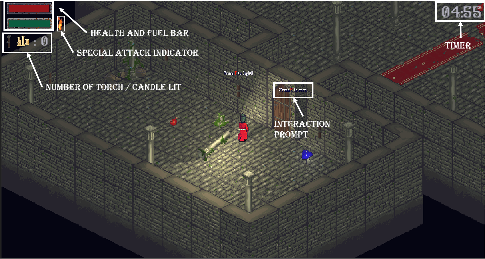

- Before the game starts we included a short introduction to the game.
- It will show after the first start and explains backstory, controls and game environment
- Intro won't show again after the player died.

## Technology and Tools

<table align="center">
    <thead>
        <tr>
            <th style="flex: 1; text-align: center;"><b>Tool</b></th>
            <th style="flex: 1; text-align: center;"><b>Purpose</b></th>
            <th style="flex: 1; text-align: center;"><b>Tool</b></th>
            <th style="flex: 1; text-align: center;"><b>Purpose</b></th>
        </tr>
    </thead>
    <tbody>
        <tr>
            <td>
                

                    

                        
                    

                

            </td>
            <td>
            Unity  
            - Development of the game  
            - Unity 2D URP
            </td>
            <td>
                

                    

                        
                    

                

            </td>
            <td>
            Visual Studio Code  
            - C# scripting  
            </td>
        </tr>
        <tr>
            <td>
                

                    

                        
                    

                

            </td>
            <td>
            GitHub  
            - Game repository  
            - Issues tab for todo's and discussions  
            - Wiki tab for instructions / guides
            </td>
            <td>
                

                    

                        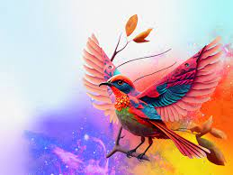
                    

                

            </td>
            <td>
            Adobe Firefly  
            - AI image creation  
            </td>
        </tr>
        <tr>
            <td>
                

                    

                        
                    

                

            </td>
            <td>
            Automatic 1111  
            - AI image creation  
            </td>
            <td>
                

                    

                        
                    

                

            </td>
            <td>
            Audacity  
            - Audio editing  
            </td>
        </tr>
        <tr>
            <td>
                

                    

                        
                    

                

            </td>
            <td>
            Aseprite  
            - Image editor for pixel art drawing and animation
            </td>
            <td>
                

                    

                        
                    

                

            </td>
            <td>
            DALL·E 2  
            - AI image creation
            </td>
        </tr>
    </tbody>
</table>

## Team Communication, Timeline, and Task Assignment

### Team Communication

<table align="center">
    <thead>
        <tr>
            <th style="flex: 1; text-align: center;"><b>Tool</b></th>
            <th style="flex: 1; text-align: center;"><b>Purpose</b></th>
            <th style="flex: 1; text-align: center;"><b>Tool</b></th>
            <th style="flex: 1; text-align: center;"><b>Purpose</b></th>
        </tr>
    </thead>
    <tbody>
        <tr>
            <td>
                

                    

                        
                    

                

            </td>
            <td>
            Whatsapp  
            - Fast communication
            </td>
            <td>
                

                    

                        
                    

                

            </td>
            <td>
            Google Drive  
            - File share  
            - Working together on documents 
            </td>
        </tr>
        <tr>
            <td>
                

                    

                        
                    

                

            </td>
            <td>
            Discord  
            - Meetings  
            - Exchanging ideas
            </td>
            <td>
                

                    

                        
                    

                

            </td>
            <td>
            Monday  
            - Project management  
            - Delegate tasks  
            - Track team's progress
            </td>
        </tr>
    </tbody>
</table>

### Timeline

    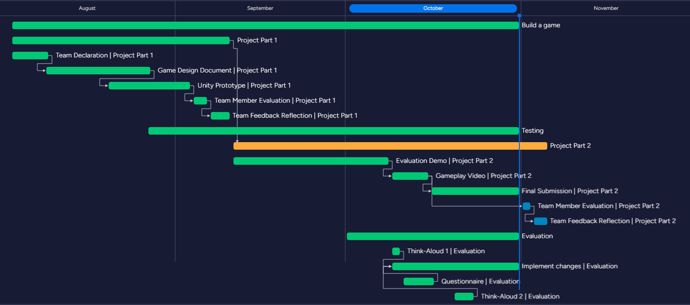
    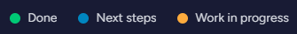

### Task Distribution

| Task                 | Main Responsibility | Collaboration |
| -------------------- | ------------------- | ------------- |
| Project Management   | Linda               | All others    |
| Ideas                | -                   | All           |
| Game Design Document | -                   | All           |
| Art & Design         | Joe                 | All others    |
| Audio                | Katherine           | All others    |
| Development          | All                 | -             |
| Testing              | Muhammed            | All others    |
| Evaluation           | Linda               | All others    |

## Possible Challenges

| Challenges                                                                          | Resolution approach                                              |
| ----------------------------------------------------------------------------------- | ---------------------------------------------------------------- |
| Avoiding situations where players can win by hiding in a corner for the entire game | Enemies spwan around the main character                          |
| Design appropriate level difficulty that is challenging but not too difficult       | Testing, Evaluation                                              |
| Time constraints (work, other subjects)                                             | Good time management, efficient working, equal distributed tasks |
| Unity, GitHub or Scripting problems                                                 | Attend classes, ask questions early enough, own research         |
| Merge conflicts                                                                     | Utilize Communication channel to schedule commits                |
| Creating own assets, very time consuming                                            | distributet the work to two people                               |
| evaluations got delayed due to time issues                                          | did evaluations later than planned, shorter time for analysis    |
