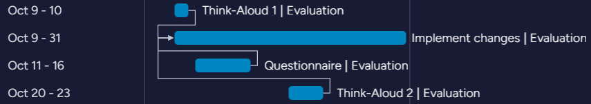
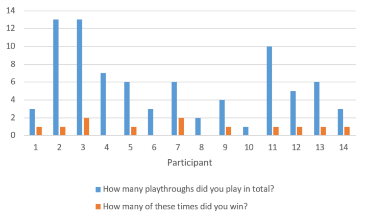
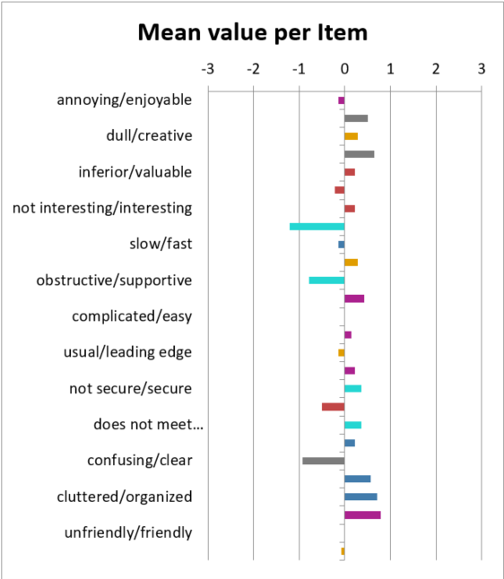
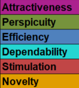
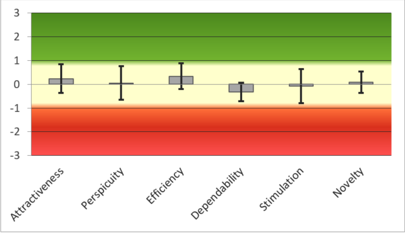
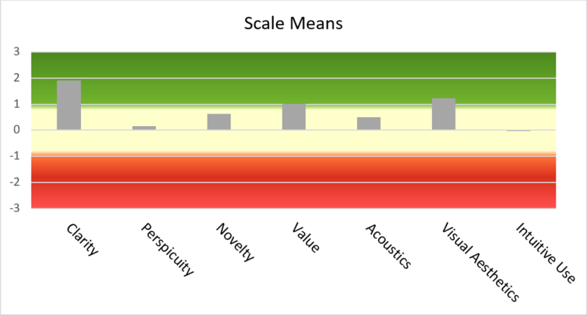
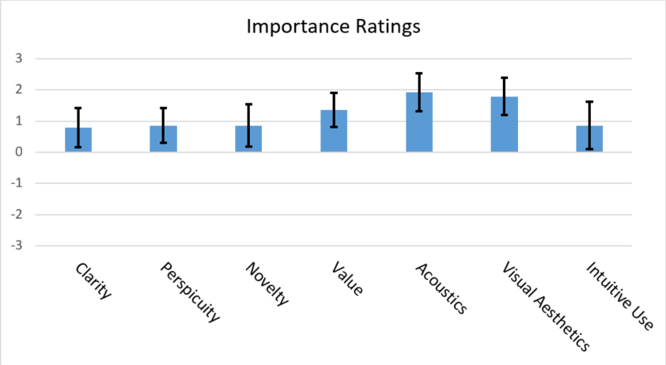
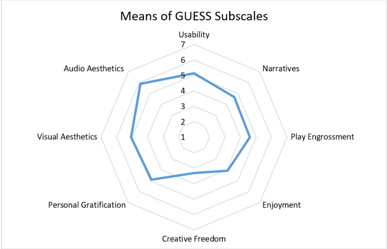
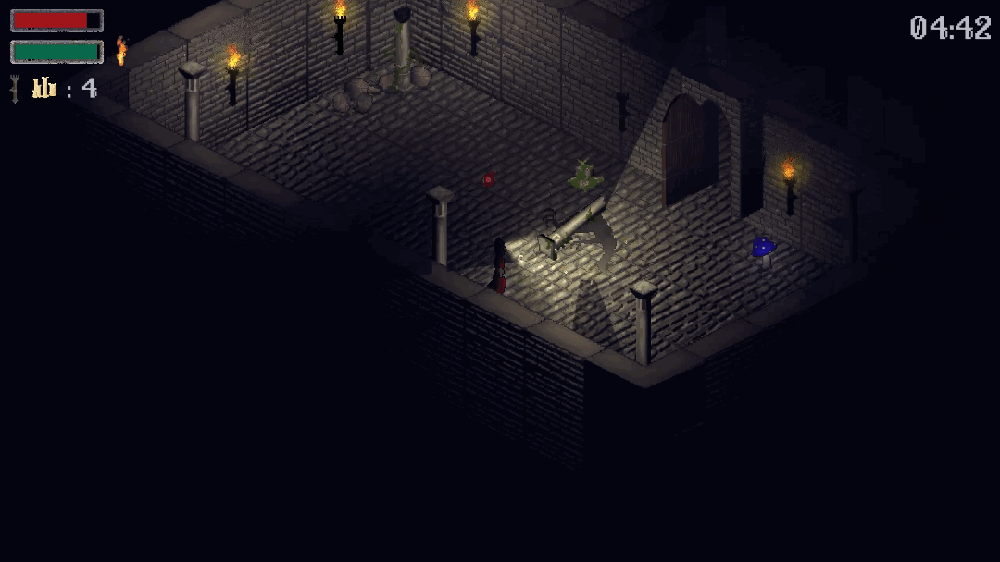
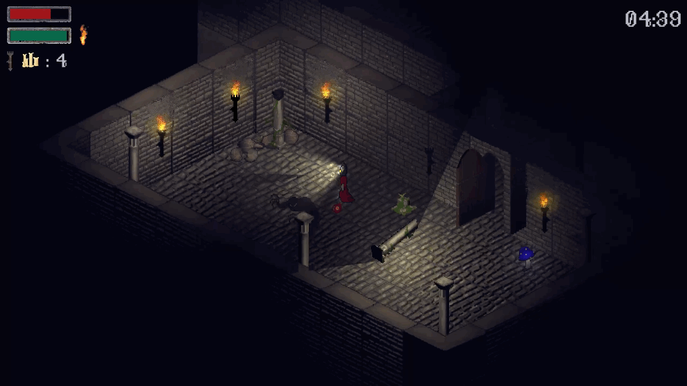

# Project 2 Report

Read the [project 2
specification](https://github.com/COMP30019/Project-2-Specification) for
details on what needs to be covered here. You may modify this template as you see fit, but please
keep the same general structure and headings.

Remember that you must also continue to maintain the Game Design Document (GDD)
in the `GDD.md` file (as discussed in the specification). We've provided a
placeholder for it [here](GDD.md).

## Table of Contents

- [Evaluation Plan](#evaluation-plan)
- [Evaluation Report](#evaluation-report)
- [Shaders and Special Effects](#shaders-and-special-effects)
- [Summary of Contributions](#summary-of-contributions)
- [References and External Resources](#references-and-external-resources)

## Evaluation Plan

### Evaluation Goals

- Can users survive for 5 minutes? (is it too hard)
- High usability and fun scores
- Are the controls and mechanics intuitive for the average player?

### Evaluation Techniques

- Quantitative: Usability questionnaires, Gamification questionnaire
- Qualitative: Think Aloud, Open-text questions

#### Think-Aloud

- There will be two evaluation dates: one at an early stage with 2-3 users and a subsequent one after the questionnaire evaluation with an additional 2-3 participants.
- Each group member conducts this method with at least one person.
- The user plays the game and will be asked to comment on the game at the end:
  - Positive/negative/general comments.
- In total, 5 users evaluate the game, making notes either digitally or with paper and pencil.
- The evaluation can be conducted either in person or online.
- Audio and screen will be recorded during the evaluation.
- All test participants will receive the same initial information through a specially created [introduction sheet](https://drive.google.com/file/d/1dLjN_s4AtCu-NaBUUQMKNmOWQ_3XVet7/view?usp=sharing), ensuring comparability across sessions, even when conducted by different test leaders.

Why this method:

- by vocalising thoughts, reactions, and decision making the user gives great insights which will help us understand the cognitive processes and offer valuable feedback for game improvements
- We have chosen for an early implementation of the think-aloud method, as this allows us to get first impressions of unexpected inputs and ways of thinking. Furthermore we will be able to fix major bugs at an early stage if necessary.
- We chose a smaller number of test subjects because of the greater time required to carry out and evaluate the study.

#### Questionnaire

- Each group member finds 4-5 people to evaluate our game
- The user plays the game and answers a questionnaire
- In total 16-20 users that evaluate our game
- Feedback can be provided in an open text box
- All test persons receive the same initial information in the form of a specially created [introduction sheet](https://drive.google.com/file/d/1rr8IC7QBDed51XXuy9KcfTNWLoqm-V8Z/view?usp=sharing)

### Why this method?

- Questionnaires provide a consistent set of questions for all participants, ensuring that the feedback is standardised. This allows for easier analysis and comparison of results.
- With structured responses, such as Likert scales, the data collected can be easily quantified, making it simpler to identify trends, preferences, and areas of improvement.
- Questionnaires can be distributed to a large number of participants simultaneously. This allows for the collection of a substantial amount of feedback in a relatively short period.

### Evaluation consists of two questionnaire parts

#### User Experience Questionnaire (UEQ and UEQ+)

[UEQ](https://www.ueq-online.org) and [UEQ+](https://ueqplus.ueq-research.org) focus on the _usability_ of the game

- UEQ evaluates:
  - Efficiency -> how good does the user understand what to do
  - Satisfaction -> is the game easy to play?
  - Usability
- Why and explanation UEQ and UEQ+
  - Standardised UEQ questionnaire for measuring the user experience of interactive products.
  - UEQ contains 26 items that can be classified into six categories: Attractiveness, Perspicuity, Efficiency, Dependability, Stimulation and Novelty.
  - The UEQ+ is an extension of the UEQ Questionnaire, which is modular so that it can be optimally adapted to the evaluation of a specific product

#### Game User Experience Satisfaction Scale (GUESS-18)

[GUESS-18](https://uxpajournal.org/validation-game-user-experience-satisfaction-scale-guess/) assesses the _enjoyment and playability_ of the game.

- Game User Experience Satisfaction Scale evaluates
  - Usability/Playability
  - Narratives
  - Play Engrossment
  - Enjoyment
  - Creative Freedom
  - Audio Aesthetics
  - Personal Gratification
  - Social Connectivity
  - Visual Aesthetics
- about GUESS
  - Abridged version of the [GUESS](https://soar.wichita.edu/bitstream/handle/10057/11604/d15018_PHAN_Mikki_SP15%20SEQUESTER.pdf;jsessionid=35F354DE576A784F3DAFB6B59BE24519?sequence=1) (55 items), which is used to evaluate video games
  - Based on 13 game related questionnaires (measuring motivation, engagement, enjoyment, experience, usability, playability,...)
  - was created through the process of Item pool creation, followed by an expert review, a pilot study and a final expert review of the statements
  - The participants are presented with short statements that are recorded on a 7-point Likert scale from "strongly disagree" to "strongly agree".
- why GUESS
  - 7-point scale
    - This makes it easier for participants to rate, as many tend to avoid the extreme ranges, and at the same time another scale reduces the jumps in meaning between two values.
  - short statements with good comprehensibility
    - therefore the subjective impression can be recorded briefly and clearly
  - Randomised order of question
    - Avoidance of sequence effects
  - Social connectivity is not surveyed in the context of our game. In addition, usability/playability is already covered by the UEQ, which is why the evaluation of this questionnaire will not focus on it here. However, it is a good opportunity to compare whether similar results emerge from both surveys.

### Evaluation Process

1. Introduction before the game (Introduction Sheet)
   - This informs the participants about the evaluation process and their legal options. At the same time, an introduction sheet offers the possibility to provide the players with information about the task to be carried out as well as instructions on how to participate in the evaluation.
2. User plays the game (Think-Aloud: with verbalizations)
3. Fill in [questionnaire](https://forms.gle/sWCzxHNidSN8rj7f6) / Commenting on the game (Think-Aloud)

### Participants

- Think-Aloud: Each group member recruits at least one person (friends & family) - in total 5 participants will be recruited for this method
- Questionnaires: Each group member recruits 4-5 people (friends, family, uni)

What qualifying criteria will you use to ensure that they are representative of your target audience?

- Age: 18+ (open end, so you’re of legal age and allowed to participate in survey)
- Interested in gaming, survival games, video games
- English speaking
- No prior information about the game (only given information of introduction sheet)
- For questionnaire evaluation (person has not played the game in the process of the Think Aloud method)

All participants receive the same information exclusively through the Introduction Sheet in advance to ensure that the players are not influenced or receive different amounts of information in advance due to different experiment leaders conducting the experiment.

### Data Collection

What sort of data is being collected?

- Quantitative data
  - responses from questionnaires
  - metrics such as completion rates
- Qualitative data
  - feedback from Think-Aloud method
  - open-text responses

How will you collect the data?

- Think-Aloud
- Questionnaires

What tools will you use?

- Think-Aloud: Take notes in digital form or with pen and paper, audio and screen recording
- Questionnaire: Google Forms

### Data Analysis

How will you analyse the data?

- Data analysis tools for Excel are used to evaluate the evaluation.
- For the evaluation of the [UEQ](https://docs.google.com/spreadsheets/d/1ep9RGBhArVEjROU2To2whGNUHLM-hauG/edit?usp=sharing&ouid=113135577092675312398&rtpof=true&sd=true) and the [UEQ+](https://docs.google.com/spreadsheets/d/10Rlr6XrActTDj76iGxTL37rfgIx--SUs/edit?usp=sharing&ouid=113135577092675312398&rtpof=true&sd=true) Questionnaire, the respective data analysis tool by Dr. Martin Schrepp is used.
- For the evaluation of the [GUESS-18](https://docs.google.com/spreadsheets/d/1VvqeABXb-Vwt2shMZ4wBmDfe7cELBSEn/edit?usp=sharing&ouid=113135577092675312398&rtpof=true&sd=true), the data analysis tool by William J. Shelstad is used.

 

- Make graphics for report and evaluation of our goals
- Draw conclusions on usability improvements
- Draw conclusions on game-fun
- Create work plan to solve identified issues
- If one user makes a comment, do you act on it? Do you need multiple people to have commented on the same thing?
  - we will decide on each issue independently
  - if only one person points out a major problem or something we consider as very important, we will definitely make changes
  - smaller, not game relevant points have to be discussed in the group whether they should be changed or not (also if more than one person mentioned the minor issue)

### Responsibilities

Who is responsible for each task?

- All team members are responsible for recruiting participants for the evaluation.
- Creating evaluation plan - Linda
- Evaluation analysis - Linda
- Implementing changes - everyone

How will you ensure that everyone contributes equally?

- Most of the things are done by everyone therefore it is contributed equally already
- Other tasks that are not contributed to in equal measure will balance out through implementation

### Timeline

    
    

## Evaluation Report

### Definition of Objectives

The primary objectives of the evaluations were to assess the game's usability and the overall enjoyment derived by the players. In preparation for the evaluations, three primary goals were identified:

1. Goal: Can users survive for 5 minutes? (Determining the game's difficulty level)
2. Goal: Achieve high usability and enjoyment scores.
3. Goal: Are the game controls and mechanics intuitive for the average player?

### Evaluation Methods

The goals were evaluated using two main methods:

- Quantitative: Usability questionnaires UEQ, UEQ+, and a Gamification questionnaire GUESS-18
- Qualitative: Think Aloud technique and Open-text questions.

### Preparations

- Designed an Introduction Sheet for both types of evaluations.
- The Introduction Sheet informed participants about the game's progression, the evaluation process, and their legal rights.
- For participant selection, the following criteria were considered:
  - Age: 18 and above (to ensure participants are of legal age).
  - Interested in gaming, especially survival games and video games.
  - Proficient in English.
  - No prior knowledge about the game.
  - For questionnaire-based evaluations, the participant must not have played the game using the Think Aloud technique.

### Execution

#### • Evaluation Methodologies

1. Think Aloud: This method involves participants verbalizing their thoughts while playing the game. It provides qualitative insights into the players' mental models and their interactions with the game system.
2. Questionnaire Evaluation: Participants play the game independently after being briefed with the Introduction Sheet. Post gameplay, they provide feedback using the provided questionnaires which were made available via a Google Survey link.

#### • Evaluation Process (uniform for all evaluations)

1. Introduction to the game (via the Introduction Sheet).
2. Game-play session (Think-Aloud method involved verbalizing thoughts).
3. Filling in the questionnaire or providing comments about the game.

### Think Aloud Evaluations (1st and 3rd Evaluation)

- Total of 5 participants
- Conducted in person with the experimenter in the room, though out of direct sight to avoid influencing participants.
- Every participant was given the same introductory information via the Introduction Sheet to ensure consistent feedback.
- During gameplay, participants verbalized their thoughts.
- Post-game, participants provided verbal feedback, allowing for qualitative insights and specific feedback.

### Questionnaire Evaluation (2nd Evaluation)

- 14 participants ranging from ages 21 to 62.
  - Relatively small sample size
    - A smaller sample size might not capture the diversity of opinions and experiences of the broader audience
    - However, the results still offer preliminary insights and could point toward trends
- Participants were provided with the Introduction Sheet, followed by independent gameplay. They subsequently evaluated the game using the UEQ, UEQ+, and GUESS-18 questionnaires.

### Data Analysis

- Tools designed for Excel were employed for evaluation data analysis.
- For UEQ and UEQ+ questionnaires, Dr. Martin Schrepp's data analysis tool was utilized.
- For GUESS-18, William J. Shelstad's data analysis tool was deployed.

### Game Improvements

#### After Evaluation 1

- Based on Feedback:

<table>
    <thead>
        <tr>
            <th>Feedback</th>
            <th>Improvements</th>
        </tr>
    </thead>
    <tbody>
        <tr>
            <td>No introduction</td>
            <td>Added introduction to the game</td>
        </tr>
        <tr>
            <td>Audio would be nice</td>
            <td>Added audio</td>
        </tr>
        <tr>
            <td>No semi-transparent walls (hard to navigate)</td>
            <td>Tried to implement, but in the end, due to the difficulty and other priorities, it was not implemented</td>
        </tr>
        <tr>
            <td>What is the green performance indicator?</td>
            <td>Icons added for indicator explanations; Symbol added indicating when a special attack is available</td>
        </tr>
        <tr>
            <td>More motivation and the need to move / explore</td>
            <td>Game mechanic added so that the player must always turn on light sources that turn off randomly over time or are turned off by enemies; if no light source is on, the player loses</td>
        </tr>
        <tr>
            <td>Increase enemy speed (easy to run away)</td>
            <td>Adjusted to a balanced level</td>
        </tr>
        </tr>
        <tr>
            <td>Can enemy go through doors? (Should be possible)</td>
            <td>Collider issues fixed</td>
        </tr>
        <tr>
            <td>Dash on different control would be preferred</td>
            <td>No changes as we think it is a good choice and only one person gave this feedback, waiting to see if the same feedback comes out in the next evaluation, then it can still be changed</td>
        </tr>
    </tbody>
</table>

- Based on observations by the game instructor:
  - Fixed more collision problems.
  - Pause button (so player can check controls again).
  - Changes to level design and the number of light sources (too much light, which took away the mysterious and tense moment).
  - Game difficulty still too easy (too few enemies, so spawn count and time adjusted, added another type of enemy).
  - After 2 successful attempts, no end scene was shown - problems fixed.

#### After Evaluation 2

The numbers behind the feedback indicate how many player gave this response

<table>
    <thead>
        <tr>
            <th>Feedback</th>
            <th>Improvements</th>
        </tr>
    </thead>
    <tbody>
        <tr>
            <td>Won with just staying in the first room, re-lighting 2 torches (no enemy spawned) (1)</td>
            <td>Adjustments to the spawn function made</td>
        </tr>
        <tr>
            <td>Didn't know what LMB and RMB in the controls means (1)</td>
            <td>UI adjustments made -> fully written out</td>
        </tr>
        <tr>
            <td>Problems with boundaries (1)</td>
            <td>Fixed colliders on walls</td>
        </tr>
        <tr>
            <td>No see-through walls (1)</td>
            <td>None. Tried to implement, but in the end, due to the difficulty and other priorities, it was not implemented</td>
        </tr>
        <tr>
            <td>Improve collision on objects (3)</td>
            <td>Adjusted colliders of objects</td>
        </tr>
        <tr>
            <td>Change winning page: "could be done for the player so feel "achieved" after survival (1)</td>
            <td>Adjustments made in the introduction (Purpose of fire and light sources that need to be kept running; Objective more precisely defined -> that you must survive 5 minutes)</td>
        </tr>
        <tr>
            <td>Player won the game but didn’t know why (1)</td>
            <td>End screen improved</td>
        </tr>
        <tr>
            <td>Add more attacks (1)</td>
            <td>None. Not desired by us or deemed necessary, however, if there was ongoing development, it would definitely be conceivable</td>
        </tr>
        <tr>
            <td>Be more mousepad friendly (2)</td>
            <td>None, as we did not intend to play with a mousepad (we should have been more precise in our introduction sheet)</td>
        </tr>
        <tr>
            <td>Visual Feedback in combat missing (2)</td>
            <td>Added for both player and enemy hits; brief flash effect when hit (character turns white); Blood splatter when "lanternhead" is hit</td>
        </tr>
        <tr>
            <td>Need more health on your character and maybe some weapon pick-ups to spice things up (1)</td>
            <td>None. Health-Value is our game decision. However, in further development, it is conceivable that more weapons could be integrated</td>
        </tr>
        <tr>
            <td>Sound effect should be added to indicate minions are close by (especially the black ones)...</td>
            <td>No change wanted.   - Player needs to learn during the gameplay how to handle it.   - Part of the gameplay and narrative: Shadows make no noise</td>
        </tr>
    </tbody>
</table>

#### After Evaluation 3

<table>
    <thead>
        <tr>
            <th>Feedback</th>
            <th>Improvements</th>
        </tr>
    </thead>
    <tbody>
        <tr>
            <td>Minor wording suggestion on the introduction slide in our game</td>
            <td>Changed as suggested</td>
        </tr>
        <tr>
            <td>Waterfall was a weak point, as players could go out of bounds</td>
            <td>Added collider</td>
        </tr>
        <tr>
            <td>Colorful objects seemed to have a specific purpose, because they were so noticeable, players tried to figure out whether they could collect or destroy them.</td>
            <td>No changes made, as these belonged to the level design and, in case there is no more lantern light, served as small light sources for orientation.</td>
        </tr>
        <tr>
            <td>Central part should have more indications to it.  - Because then the player gets a better feeling to where the centre of the map is and when to expect the edge of the map  - Would be sad to miss it as it an important part of the narrative
            </td>
            <td>Added lightsource to the fire and animated asset</td>
        </tr>
    </tbody>
</table>

### Final Assessment of Goals

#### Goal 1: Can users survive for 5 minutes?

- After Evaluation 1: The game was perceived as too easy, necessitating adjustments.
- After Evaluation 2: All but one player managed to win the game at least once. Crucially, no players won on their initial attempt, hinting at an appropriate level of challenge.
- After Evaluation 3: While players did not achieve victory on their debut, every participant eventually had a successful run, indicating a well-balanced difficulty level.

    
    
Bar chart showcases data from 14 participants' playthroughs of our game, delineating total playthroughs from victories. Blue bars depict total playthroughs, while orange bars signify wins.
    

##### Conclusion

The evaluation helped us to develop our game to a balanced level of difficulty, so that it is not too difficult and therefore winnable, but also challenging for the players.

#### Goal 2: High usability and fun scores

##### UEQ Results

    
    

- The graph presents a spectrum of mean values for the contrasting attributes of the UEQ questionnaire. The scale ranges from -3 to 3, with 0 being neutral.
- The majority of attributes received positive or near-neutral feedback. Respondents seemed to appreciate the games creativity, interest level, cutting-edge nature, security, clarity, and friendliness. However, there were mixed feelings about the games speed, supportiveness, complexity, and organization.

    

- The graph illustrates the mean values for the categories of the UEQ.
- The lines indicate the variance among the ratings
- Most of the criteria received positive feedback, highlighting Attractiveness, Perspicuity, and Novelty as the standout positive attributes.
- The mean value for Dependability is just below neutral, suggesting that there are some concerns about the reliability or consistency of the game among the respondents.

##### Conclusions

- The game stands out as attractive, novel, and clear. Users largely had a positive reception to its presentation, design, and functionality.
- Attractiveness: Users were drawn to the game's aesthetics, lauding it for its stimulating and novel design elements.
- Clarity: The game's mechanics and objectives were mostly clear, which is testament to the product's user-friendly design.
- Dependability & Efficiency: Feedback suggests that some gameplay elements were not consistent, which could affect the gameplay experience. Specific comments on problems related to movement dynamics, hitboxes and boundaries explain the survey results.

##### UEQ+ Results

    

- The graph displays the mean values for attributes from the UEQ+.
- The game generally receives positive feedback on its Clarity and Intuitive Use, suggesting ease of understanding and navigation.
- Visual Aesthetics and Novelty are also seen in a favourable light, albeit less pronounced.
- Acoustics and Value are areas where the perception is more neutral, hinting at potential areas for enhancement.

    

- This graph presents the "Importance Ratings" for various attributes
- Each attribute has been evaluated on a scale from -3 to 3, with the bars representing the mean importance score and the lines indicating the variance among the ratings.
- All attributes are perceived as somewhat important, with none dipping into the negative zone.
- "Value" and "Acoustics" are rated as more critical than attributes like "Intuitive Use" and "Clarity".
- There's a noticeable variance in ratings for several attributes, suggesting diverse opinions among respondents about the relative importance of certain criteria.

##### Conclusions

- Clarity: Indicates that users find the interface straightforward.
- Intuitive Use: Large variances in the evaluation. This variance is most likely also due to the comments of dissatisfaction of the mousepad users, who indicated control problems as feedback.
- Visual Aesthetics: Users generally appreciate the visual aspects, but there's potential to further elevate this aspect.
- Acoustics: Due to the high importance rating, the result is to be considered rather negative

##### GUESS-18 Results

    

- This radar chart illustrates the "Means of GUESS Subscales".
- The chart is structured with values ranging from 1 to 7, indicating the mean score for each of the subscales. (1 – lowest score, 7 – highest score).
- The radar chart gives an overview of user perceptions across multiple facets of their gameplay.
- The highest-rated attributes are "Usability" and "Visual Aesthetics", both of which surpass scores of 4.5.
- Enjoyment has a score very similar to Play Engrossment, suggesting users find the experience moderately enjoyable but not exceptionally so.

##### Conclusions

- Usability: With a score nearing 5 out of 7, the game offers a user experience that is mostly intuitive and user-friendly.
- Enjoyment: Scoring similarly to Play Engrossment, the game provides a moderate level of enjoyment. Possible enhancement for Player Engagement and Enjoyment could have been a more immersive narrative or storyline but due to the subjects timeframe not adjusted after this evaluation.
- Visual Aesthetics: Visual elements score close to 5, showcasing their appeal to users.
- Audio Aesthetics: The audio elements are slightly behind the visual elements with 4.5. The lack of direct comments on these elements may indicate that users found them satisfactory but not outstanding.

#### Goal 3: Are the controls and mechanics intuitive for the average player?

- Evaluation 1: Players found the controls largely intuitive, with only the dash function receiving comments.
- Evaluation 2: The majority perceived the controls as intuitive. However, some found it challenging to play using a mousepad. Clarity regarding optimal controls, specifically in the introduction, could have mitigated this feedback.
- Evaluation 3: Feedback was consistent with previous evaluations, with players expressing that the controls felt intuitive.

##### Conclusion

The evaluations have shown us that we have succeeded in our goal of creating an intuitive use for the average player.

## Shaders and Special Effects

We developed two custom shaders for our game: the [Heat Haze Shader](Assets/HeatHaze.shader) and the [Enemy Special Attack Shader](Assets/EnemySpecialAttack.shader). The _HeatHaze_ shader displaces pixels captured by the `CameraSortingLayerTexture` according to the intensity of the alpha channel of a sampled pseudo-noise texture, then displaces in `x` by the cosine of time and in `y` by the sine of time, creating a wavy effect. The heat haze is applied to various torches and candles in the game.

These shaders explored the power of the `CameraSortingLayerTexture` in shader language to create distinct distortion effects that integrated with the in-game scene and make more appealing visual effects.

Drawing inspiration from [this tutorial]("https://www.youtube.com/watch?v=-spc1GJAtLY"), we discovered that through manipulating unity layer settings, we could create a transparent shader capable of manipulating the camera view to introduce interesting distortion effects to our game environment.

The Heat Haze Shader utilized the `CameraSortingLayerTexture` and incorporating a custom noise texture that inspired by [this tutorial]("https://lindenreidblog.com/2018/03/05/heat-distortion-shader-tutorial/") to simulate random distortion patterns, closely resembling the visual dynamics of a real heat haze.

[Click here for the Heat Haze effect](https://drive.google.com/file/d/1luGvsgK1eYyT0Xd18oKIiZMMQNA9TDOE/view?usp=sharing)

On the other hand, the 'Enemy Special Attack Shader' was designed to enhance the visual impact of our enemy attacks. This shader integrates the `CameraSortingLayerTexture` with the smoothstep function, which effectively interpolates values to create a captivating void orb. When shot by the enemy, player will see a transparent orb that distorts the game environment, immersing players in a visually dynamic experience. Also, we incorporated dynamic sizing for the orb with the game time to further enhance the visual effects.

[Click here for the Enemy Special Attack effect](https://drive.google.com/file/d/1_x5gNXHtKNCtpo8iVLikuD9jPpI5Z8N3/view?usp=sharing)

### [Damage Particle System](Assets/Prefabs/BloodSplatter.prefab)

#### Player

- BloodSplatter Particle System object with matching script is spawned at the player when they take damage.
- Particles last 0.5 seconds each, move at 1.0f under 0.7f gravity, and shrink faster the longer they exist.
- Blood particles are generated in a burst of 30, initially moving in a semicircle upwards.
- The particle system is destroyed 1 second after it is created.
- Particles collide with the environment and are affected by light, since that felt the most immersive when testing.

    

#### Enemies

Enemies spawn the same prefab as players on taking damage but modify some values after instantiation:

- The colour is set to black to match their shadow theme
- Gravity is turned off to make them feel weightless and ethereal
- Particle start speed is set to 0.7f for the same reason
- The number of particles spawned is set to 1/7th the damage dealt, giving a feeling of impact to stronger attacks
- The full 30 particles are spawned on death to show the enemies bursting or dispersing for immersion and to give an indication they died since health bars don't show on enemy death

	

## Summary of Contributions

| Task                       | Main Responsibility | Collaboration |
| -------------------------- | ------------------- | ------------- |
| Project Management         | Linda               | All others    |
| Ideas                      | -                   | All           |
| Game Design Document       | -                   | All           |
| Art & Design               | Joe                 | All others    |
| Audio                      | Katherine           | All others    |
| Development                | All                 | -             |
| Testing                    | Muhammed            | All others    |
| Evaluation                 | Linda               | All others    |
| Shader and Special Effects | All                 | All           |

## References and External Resources

<b>Soundtracks</b>
| Soundtracks | References|
| -------- | -------- |
| Starting Screen | [György Ligeti - Atmospheres](https://youtu.be/RCNzwdLwA8g?t=289) |
| In-game Background | [Brandon75689 - Cave Theme](https://opengameart.org/content/cave-theme)|
| Game Over | [Clement Panchout - Game Over Jingles Pack - 48 GameOverJingle Saturday](https://opengameart.org/content/69-game-over-jingles-pack) |

 

<b>Sound Effects</b>
| Sound Effects | References |
| -------- | -------- |
| Speical Attack | [Fuel explosion](https://mixkit.co/free-sound-effects/fire/) |
| Melee Attack | [Opengameart.org - 3 melee sounds](https://opengameart.org/content/3-melee-sounds/) |
| Attack Hit| [Opengameart.org - Fleshy Fight Sounds](https://opengameart.org/content/fleshy-fight-sounds) |
| Open Door | [Pixabay - Door open and close](https://pixabay.com/sound-effects/door-open-and-close-65541/) |
| Close Door | [Pixabay - Door open and close](https://pixabay.com/sound-effects/door-open-and-close-65541/) |
| Candle Snuff when Enemy Approaches | [Mixkit - Wizard fire woosh / Ghost fire woosh](https://mixkit.co/free-sound-effects/fire/) |
| Heal | [Opengameart.org - 3 heal spells](https://opengameart.org/content/3-heal-spells) |
| Fuel Pick Up | [Pixabay – Item Equip](https://pixabay.com/sound-effects/item-equip-6904/) |
| Lantern Refill | [Pixabay – Oil lantern open and close](https://pixabay.com/sound-effects/oil-lantern-open-and-close-27693/) |
| Light A Match | [Pixaby - 071684_light_match.wav](https://pixabay.com/sound-effects/071684-light-matchwav-89669/) |
| Menu Hover | [Opengameart.org - UI Soundpack by m1chiboi - bleeps and clicks](https://opengameart.org/content/ui-soundpack-by-m1chiboi-bleeps-and-clicks) |
| Menu Select | [Opengameart.org - Zippo click sound](https://opengameart.org/content/zippo-click-sound) |
 

<b>Art</b>
| Art | References |
| -------- | -------- |
| Central Fire Sprite | [Animated Fire](https://opengameart.org/content/animated-fire) |
| Water Texture | [3dtextures-water](https://3dtextures.me/2018/11/29/water-002/) |
